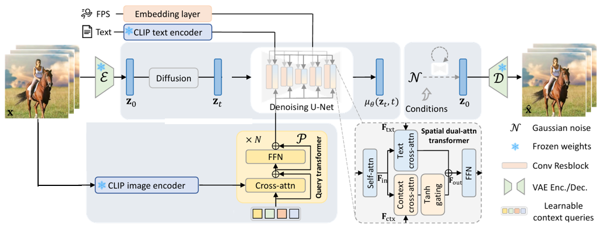

## ___***Composite Video Generation***___

### Dataset

 
## Version-1 (till Sept. 11th)
### Overview

The 

### 1.1. Showcases (320x512)

<table class="center">
  <tr>
    <td colspan="1">Refrence Video</td>
    <td colspan="1">"erupting volcano"</td>
    <td colspan="1">"black clouds"</td>
    <td colspan="1">"an airplane in the sky"</td>
  </tr>
  <tr>
  <td>
    
  </td>
  <td>
    
  </td>
  <td>
    
  </td>
  <td>
    
  </td>
  </tr>

  <tr>
    <td colspan="1">Refrence Video</td>
    <td colspan="1">"red hair"</td>
    <td colspan="1">"a woman is crying"</td>
   <td colspan="1">"a woman is laughing"</td>
  </tr>
  <tr>
  <td>
    
  </td>
  <td>
    
  </td>
  <td>
    
  </td>
  <td>
    
  </td>
  </tr>

   <tr>
    <td colspan="1">Refrence Video</td>
    <td colspan="1">"a man is eating"</td>
    <td colspan="1">"eating a cake"</td>
   <td colspan="1">"an Asian"</td>
  </tr>
  <tr>
  <td>
    
  </td>
  <td>
    
  </td>
  <td>
    
  </td>
  <td>
    
  </td>
  </tr>

   <tr>
    <td colspan="1">Refrence Video</td>
    <td colspan="1">"red shirt"</td>
    <td colspan="1">"long hair"</td>
   <td colspan="1">"a girl"</td>
  </tr>
  <tr>
  <td>
    
  </td>
  <td>
    
  </td>
  <td>
    
  </td>
  <td>
    
  </td>
  </tr>

   <tr>
    <td colspan="1">Refrence Video</td>
    <td colspan="1">"black phone"</td>
    <td colspan="1">"green wall"</td>
  </tr>
  <tr>
  <td>
    
  </td>
  <td>
    
  </td>
  <td>
    
  </td>
  </tr>

   <tr>
    <td colspan="1">Refrence Video</td>
    <td colspan="1">"it's running"</td>
  </tr>
  <tr>
  <td>
    
  </td>
  <td>
    
  </td>
  </tr>
  <!-- <tr>
    <td colspan="2">"two people dancing"</td>
    <td colspan="2">"girl talking and blinking"</td>
  </tr>
  <tr>
  <td>
    
  </td>
  <td>
    
  </td>

  <td>
    
  </td>
  <td>
    
  </td>
  </tr> -->

  <!-- <tr>
    <td colspan="2">"zoom-in, a landscape, springtime"</td>
    <td colspan="2">"A blonde woman rides on top of a moving  washing machine into the sunset."</td>
  </tr>
  <tr>
  <td>
    
  </td>
  <td>
    
  </td>

  <td>
    
  </td>
  <td>
    
  </td>
  </tr>

  <tr>
    <td colspan="2">"explode colorful smoke coming out"</td>
    <td colspan="2">"a bird on the tree branch"</td>
  </tr>
  <tr>
  <td>
    
  </td>
  <td>
    
  </td>

  <td>
    
  </td>
  <td>
    
  </td>
  </tr> -->
</table >

## ⚙️ Setup

### To be updated...

