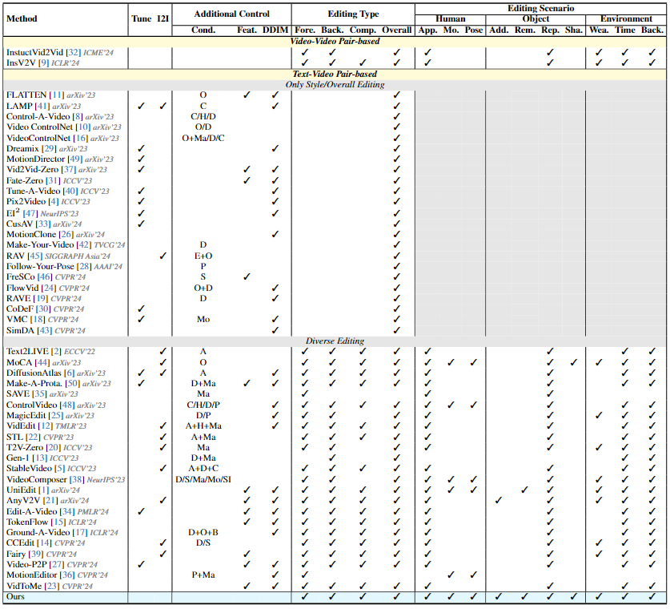
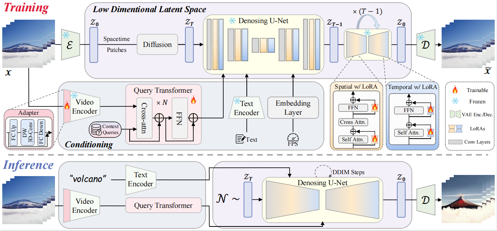
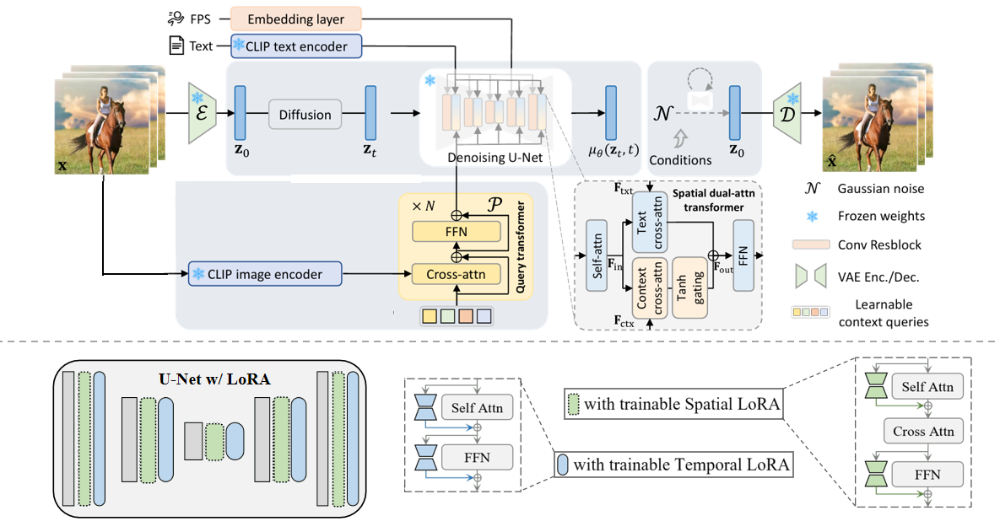

## ___***Composite Video Generation***___

### Literature Review
**Comparison with state-of-the-art text-based video editing works.** "Tune": One-shot or few-shot tuning-based; "I2I": Image editing model (e.g., InstructPix2Pix) assisted.

### Training Dataset
[OpenVid-1M: A Large-Scale High-Quality Dataset for Text-to-video Generation](https://github.com/NJU-PCALab/OpenVid-1M)

### Benchmark
[LOVEU-TGVE competition at CVPR 2023](https://github.com/showlab/loveu-tgve-2023?tab=readme-ov-file)

### Metrics

**Objective Metrics:**

PickScore: computing the average image-text alignment over all video frames

CLIP Frame (Frame Consistency): measuring the average cosine similarity among CLIP image embeddings across all video frames

Interpolation Error, Interpolation PSNR, Warp Error: temporal consistency

CLIP Text: text alignment

**User Study:**

Text Alignment

Temporal Coherence

Structure Consistency

Overall Quality

## Version-3 (Sept. 21)
### 3.1. Overview

#### Compare to Version-2, we add adapter into the CLIP visual encoder to better process the video data.

## Version-2 (Sept. 16)
### 2.1. Overview

#### Compare to Version-1, we add spatial LoRA and temporal LoRA to U-Net, and only fine-tuned LoRA, not the entire U-Net.
We found that comparing to Version-1, only fine-tuning LoRA can show better editing ability， *e.g.*, the backgroud editing.

### 2.2. Showcases (320x512)--128,000 samples/steps

<table class="center">
  <tr>
    <td colspan="1">Refrence Video</td>
    <td colspan="1">"erupting volcano"</td>
    <td colspan="1">"black clouds"</td>
    <td colspan="1">"black sky"</td>
    <td colspan="1">"an airplane in the sky"</td>
  </tr>
  <tr>
  <td>
    
  </td>
  <td>
    
  </td>
  <td>
    
  </td>
  <td>
    
  </td>
  <td>
    
  </td>
  </tr>

  <tr>
    <td colspan="1">Refrence Video</td>
   <td colspan="1">"black hair"</td>
    <td colspan="1">"red hair"</td>
    <td colspan="1">"a woman is crying"</td>
   <td colspan="1">"a woman is laughing"</td>
   <td colspan="1">"with green background"</td>
  </tr>
  <tr>
  <td>
    
  </td>
  <td>
    
  </td>
  <td>
    
  </td>
  <td>
    
  </td>
  <td>
    
  </td>
  <td>
    
  </td>
  </tr>

   <tr>
    <td colspan="1">Refrence Video</td>
    <td colspan="1">"a man is eating"</td>
    <td colspan="1">"eating a cake"</td>
    <td colspan="1">"short hair"</td>
   <td colspan="1">"an Asian"</td>
    <td colspan="1">"on the beach"</td>
  </tr>
  <tr>
  <td>
    
  </td>
  <td>
    
  </td>
  <td>
    
  </td>
  <td>
    
  </td>
  <td>
    
  </td>
  <td>
    
  </td>
  </tr>

   <tr>
    <td colspan="1">Refrence Video</td>
    <td colspan="1">"red shirt"</td>
    <td colspan="1">"long hair"</td>
   <td colspan="1">"a girl"</td>
    <td colspan="1">"on the playground"</td>
    <td colspan="1">"on the beach"</td>
  </tr>
  <tr>
  <td>
    
  </td>
  <td>
    
  </td>
  <td>
    
  </td>
  <td>
    
  </td>
  <td>
    
  </td>
  <td>
    
  </td>
  </tr>

   <tr>
    <td colspan="1">Refrence Video</td>
    <td colspan="1">"black phone"</td>
    <td colspan="1">"green wall"</td>
    <td colspan="1">"a woman"</td>
  </tr>
  <tr>
  <td>
    
  </td>
  <td>
    
  </td>
  <td>
    
  </td>
  <td>
    
  </td>
  </tr>

   <tr>
    <td colspan="1">Refrence Video</td>
    <td colspan="1">"it's running"</td>
    <td colspan="1">"red water"</td>
  </tr>
  <tr>
  <td>
    
  </td>
  <td>
    
  </td>
  <td>
    
  </td>
  </tr>
  
</table >
 
## Version-1 (Sept. 11)
### 1.1. Overview

#### Training:
**General pipeline:** Given a video, we first encode it into a latent representation frame-by-frame via the VAE encoder. Then, both the forward diffusion process and backward denoising process are performed in the latent space, where denoising conditions should be involved. Accordingly, the generated videos are obtained through the VAE decoder.

**Condition Encoding:** Different from previous T2V or I2V works that use text or single frame (image) as conditions, we adopt both text and video as conditions for U-Net simultaneously. Specifically, the text embedding is constructed with pre-trained CLIP text encoder, we employ the image encoder counterpart to extract features of frames across the given input video. We use the full visual tokens from the last layer of the CLIP image ViT to extract more complete information. Then, to obtain a context representation that can be interpreted by the denoising U-Net, a query transformer is introduced, which comprises N stacked layers of cross-attention and FFN.

Subsequently, the text embedding and context (video) embedding are emplyed to interact with the U-Net intermediate features through the dual cross-attention layers, where the *tanh* gating and adaptively learnable for each layers are employed to control the coefficient that fuses text-conditioned and video-conditioned features.

#### Inference:
During inference, given a reference video and a delta (editing) caption as conditions, our model can generate edited video from noise. Specifically, similar to video editing, two guidance scales are introduced to trade off the impact of the two control signals, *i.e.*, video condition and text condition. 

### 1.2. Showcases (320x512)--128,000 samples/steps

<table class="center">
  <tr>
    <td colspan="1">Refrence Video</td>
    <td colspan="1">"erupting volcano"</td>
    <td colspan="1">"black clouds"</td>
    <td colspan="1">"an airplane in the sky"</td>
  </tr>
  <tr>
  <td>
    
  </td>
  <td>
    
  </td>
  <td>
    
  </td>
  <td>
    
  </td>
  </tr>

  <tr>
    <td colspan="1">Refrence Video</td>
    <td colspan="1">"red hair"</td>
    <td colspan="1">"a woman is crying"</td>
   <td colspan="1">"a woman is laughing"</td>
  </tr>
  <tr>
  <td>
    
  </td>
  <td>
    
  </td>
  <td>
    
  </td>
  <td>
    
  </td>
  </tr>

   <tr>
    <td colspan="1">Refrence Video</td>
    <td colspan="1">"a man is eating"</td>
    <td colspan="1">"eating a cake"</td>
   <td colspan="1">"an Asian"</td>
  </tr>
  <tr>
  <td>
    
  </td>
  <td>
    
  </td>
  <td>
    
  </td>
  <td>
    
  </td>
  </tr>

   <tr>
    <td colspan="1">Refrence Video</td>
    <td colspan="1">"red shirt"</td>
    <td colspan="1">"long hair"</td>
   <td colspan="1">"a girl"</td>
  </tr>
  <tr>
  <td>
    
  </td>
  <td>
    
  </td>
  <td>
    
  </td>
  <td>
    
  </td>
  </tr>

   <tr>
    <td colspan="1">Refrence Video</td>
    <td colspan="1">"black phone"</td>
    <td colspan="1">"green wall"</td>
  </tr>
  <tr>
  <td>
    
  </td>
  <td>
    
  </td>
  <td>
    
  </td>
  </tr>

   <tr>
    <td colspan="1">Refrence Video</td>
    <td colspan="1">"it's running"</td>
  </tr>
  <tr>
  <td>
    
  </td>
  <td>
    
  </td>
  </tr>
  <!-- <tr>
    <td colspan="2">"two people dancing"</td>
    <td colspan="2">"girl talking and blinking"</td>
  </tr>
  <tr>
  <td>
    
  </td>
  <td>
    
  </td>
  <td>
    
  </td>
  <td>
    
  </td>
  </tr> -->

  <!-- <tr>
    <td colspan="2">"zoom-in, a landscape, springtime"</td>
    <td colspan="2">"A blonde woman rides on top of a moving  washing machine into the sunset."</td>
  </tr>
  <tr>
  <td>
    
  </td>
  <td>
    
  </td>

  <td>
    
  </td>
  <td>
    
  </td>
  </tr>

  <tr>
    <td colspan="2">"explode colorful smoke coming out"</td>
    <td colspan="2">"a bird on the tree branch"</td>
  </tr>
  <tr>
  <td>
    
  </td>
  <td>
    
  </td>

  <td>
    
  </td>
  <td>
    
  </td>
  </tr> -->
</table >

## Acknowledgements

Our work is built on top of [DynamiCrafter](https://github.com/Doubiiu/DynamiCrafter) and [VideoCrafter](https://github.com/AILab-CVC/VideoCrafter). Thanks for their awesome work!

